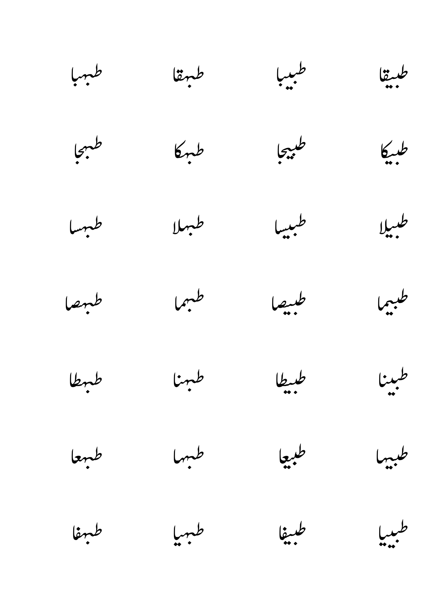
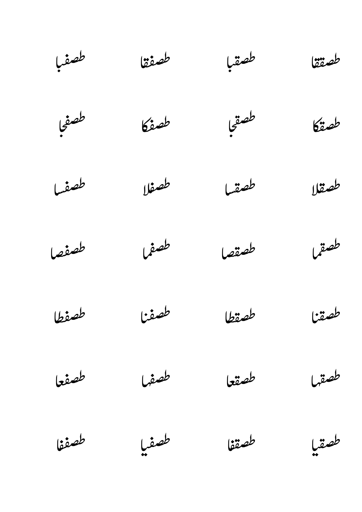

# 📝 Urdu Word Image Dataset Generator

This Python script is a complete pipeline for generating **images of Urdu words**, labeling them, and organizing them into a dataset that can be used for training machine learning models, such as OCR (Optical Character Recognition) systems.

---

## 📌 Features

- ✅ Automatically generates thousands of synthetic Urdu words based on a pattern.
- ✅ Writes the words to a `.docx` file in **Noori Nastaleeq** font.
- ✅ Converts the `.docx` file into a `.pdf`, then into individual `.png` images.
- ✅ Detects and crops each word from the image.
- ✅ Saves each word as a separate image.
- ✅ Creates a `.csv` file labeling each image with its corresponding word.
- ✅ Fully automated – no manual intervention needed.

---

## 📁 Output Structure

After running the script, the following structure is generated:

```
output/
│
├── urdu_words.docx          ← Document with generated Urdu words
├── urdu_words.pdf           ← Converted PDF
├── urdu_words_images/       ← PNG images generated from the PDF
│   ├── urdu_words_page_1.png
│   └── ...
├── labels/                  ← Folder containing cropped word images
│   ├── word_0.png
│   ├── word_1.png
│   └── ...
└── labels.csv               ← CSV file mapping images to words
```

---

## 🛠️ How It Works (Step-by-Step)

### 1. **Generate Urdu Words**
```python
generate_urdu_words()
```
- Creates a `.txt` file with 1000 randomly generated Urdu words.
- Each word is made using random characters from a list of Urdu letters.

---

### 2. **Create Word Document**
```python
create_word_document()
```
- Reads the generated words.
- Adds them into a `.docx` file in rows using the **Noori Nastaleeq** font.
- Ensures the text is properly styled and aligned for visual clarity.

---

### 3. **Convert DOCX to PDF**
```python
convert(f"{OUTPUT_FOLDER}/urdu_words.docx", OUTPUT_FOLDER)
```
- Uses the `docx2pdf` library to convert the `.docx` file into a `.pdf`.

---

### 4. **Convert PDF to PNG**
```python
convert_from_path(pdf_path, ...)
```
- Converts each page of the `.pdf` into a `.png` image using `pdf2image`.

---

### 5. **Crop Words from PNG Images**
```python
process_images_folder()
```
- Uses OpenCV to read each `.png` page.
- Converts to grayscale, detects contours, and isolates word-like regions.
- Each word is cropped and saved as a `word_#.png` file.
- Cropping is based on contour detection and sorted left-to-right, top-to-bottom.

---

### 6. **Generate CSV Labels**
```python
generate_labels_csv()
```
- Reads the cropped word images and matches them with the generated words.
- Saves this mapping in `labels.csv` with the structure:
  ```
  image_name,label
  word_0.png,کتاب
  word_1.png,قلم
  ...
  ```

---

## 📦 Requirements

Install the following dependencies before running the script:

```bash
pip install python-docx docx2pdf pdf2image opencv-python
```

Also ensure:

- **Noori Nastaleeq** font is installed and available in your system fonts.
- **Poppler** is installed and added to your system PATH for `pdf2image` to work.

---

## 💡 Use Cases

- 🔤 Training Urdu OCR models.
- 🎓 Dataset generation for machine learning research.
- 🧪 Experimenting with synthetic data for NLP/computer vision.

---

## ⚠️ Notes

- The contour-based cropping may need fine-tuning for extremely stylized fonts.
- If using another font, update this line in the script:
  ```python
  run.font.name = 'Noori Nastaleeq'
  ```

---

## ▶️ To Run the Script

Save the script as `urdu_word_image_generator.py` and simply run:

```bash
python urdu_word_image_generator.py
```

# Dataset Screenshots

Here are the screenshots of the dataset:






